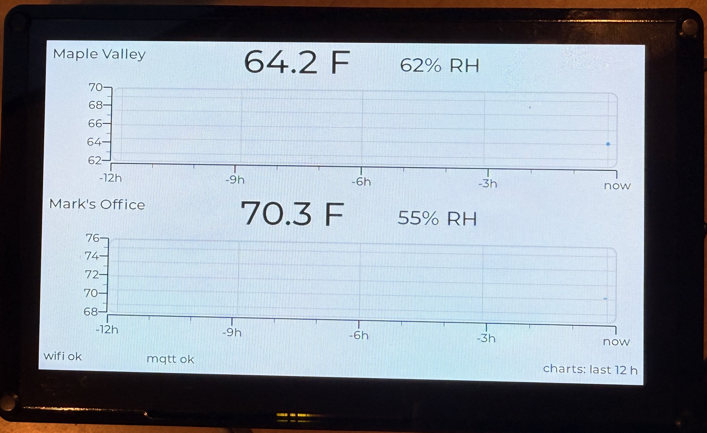

# Temperature Monitor — Elecrow CrowPanel Advance 7.0-HMI Display

Firmware for the Elecrow CrowPanel Advance 7.0-HMI ESP32-S3 display (SKU
`DIS02170A`, ESP32-S3-WROOM-1-N16R8, IPS 800x480). It shows two temperature
readings, each with humidity, in either of two views:

- **Maple Valley** — outdoor conditions, fetched from the [Open-Meteo](https://open-meteo.com/)
  public API over plain HTTP. No API key.
- **Mark's Office** — an indoor reading published by an MQTT broker at
  `192.0.2.10:1883`. The broker accepts anonymous connections; there is
  nothing to authenticate.

## The two views

**Clock**, which is what the panel shows at power-up. The time in large digits
across the top, the outdoor reading in the lower left and the indoor one in the
lower right, humidity small beneath each, white on black. No captions: position
says which is which, in the same order the chart rows are stacked. The time
comes from the board's own real-time clock, so it is right within seconds of
power-up, before Wi-Fi has associated.

**Charts**, the same two readings with twelve hours of history each, over a
status bar.



The photograph shows the chart view shortly after a reflash, which is why each
chart holds a single point — history lives in RAM and starts empty at boot.

### Touch

Two gestures, both a long press of about a second. Deliberately not buttons: the
panel is meant to be read, not operated, and a stray brush against the glass
should change nothing.

| Where | What |
| --- | --- |
| Top-right corner, 160 x 120 px | Switch between the clock and the charts, either direction |
| Anywhere else | Toggle between Fahrenheit and Celsius, in either view |

Where the press *starts* decides which fires, so a finger that drifts during
the hold cannot change its mind.

### Brightness

The backlight runs at 40% during the day and 5% between sunset and sunrise. The sun times come from the same Open-Meteo request that supplies the
outdoor reading, and are compared against the board's own clock.

That is deliberately not the API's `is_day` flag, which would also have worked.
Using the times means the change lands on the exact minute rather than whenever
the next fifteen-minute poll arrives, and it keeps working with the network
down, because the real-time clock survives a power cut.

Two details that matter more than they look. The backlight is written only when
the level actually changes, because that I2C bus is shared with the touch
controller and needless traffic on it makes the display jitter. And if the
clock or the sun times are unknown, it stays at full — a panel that is
mysteriously dim is worse than one that is too bright.

The percentages are LED current, not perceived brightness. Eyes are roughly
logarithmic, so the useful values are far lower than they look: on the real
panel 50% was barely distinguishable from full, 25% was clearly dimmer, and 5%
is where it settled. Day sits at 40% for the same reason — full output is more
than a room needs. `DAY_PERCENT` and `NIGHT_PERCENT` in `src/brightness.h` are
the two numbers to change.

There is not much room below that. 5% sends byte 232 on a scale where 245 is
off, so thirteen steps remain, and below roughly 3% the boost driver may not
light the panel reliably. Nothing reads the backlight back, so the firmware
cannot tell "very dim" from "off".

## Build and flash

```sh
cp secrets.ini.example secrets.ini     # then fill it in
pio run -e advance_70 -t upload        # build and flash over USB
pio run -e advance_70_ota -t upload    # afterwards: update over WiFi
pio test -e native                     # run 70 host tests, no hardware needed
```

`secrets.ini` holds the Wi-Fi credentials, the MQTT broker, its topics and this
panel's row label, the weather coordinates, and the over-the-air hostname and
password. It is gitignored. Put every value except `mqtt_port` in double
quotes, and keep `"`, `'`, `\`, `$`, `` ` `` and `;` out of the values, as well
as a `#` after a space. Every environment reads `secrets.ini`, the host tests
included: without it PlatformIO stops with `No section: 'secrets'`. For the
host tests alone, the unedited example is enough.

The build fetches the private library `robominds/esp32-ota-kit` (tag `v1.0.0`)
over SSH, so it needs read access to that repository.

### Updating over WiFi

The first flash after pulling this change must go over USB: it replaces the
single-app partition table with `default_16MB.csv`, which has two 6.4 MB app
slots. After that, `pio run -e advance_70_ota -t upload` sends the build to
`<device_host>.local`, authenticated with `ota_password`. A full-screen
"Updating firmware" panel shows progress on either view, and the panel reboots
into the new version. The charts start empty after every update, because their
history lives in RAM.

A new image is confirmed 30 s after Wi-Fi comes up, or 90 s after boot,
whichever comes first. One that crashes or hangs before then is rolled back by
the bootloader to the previous version. The same window has a cost:
power-cycling the panel within about 40 s of an update also rolls back a good
image; run the update again. MQTT may disconnect during an upload and
reconnects on its own if the update fails.

Two panels can run this firmware from one checkout: `indoor_label`, the two
MQTT topics and `device_host` in `secrets.ini` are what make a build the
office panel or the kitchen panel.

espota has the panel connect back to the computer. If the upload ends with
`No response from device`, allow PlatformIO's Python
(`~/.platformio/penv/bin/python`) to accept incoming connections in the macOS
firewall. `Authentication Failed` means `ota_password` differs from the one the
running firmware was built with. `No response from the ESP` or `Host ... Not
Found` means the panel did not answer to its name: check that it is on Wi-Fi and
that `device_host` matches the firmware it is running. Changing `device_host`
takes a USB flash, because the running firmware answers only to its old name.

`firmware.bin` contains the Wi-Fi and OTA passwords as plain strings, and espota
traffic is authenticated but not encrypted. Use it on a network you trust.

**On macOS, install the CH340K driver first, or the upload command above will
just fail to find a port.** This board's CH340K enumerates as `1a86:7522`, one
digit off from the `1a86:7523` and `1a86:55d4` IDs Apple's built-in driver
recognises, so macOS shows no `/dev/cu.*` device and `pio device list` shows
nothing — the board looks absent, not driver-less. Install WCH's
`CH34xVCPDriver` (<https://github.com/WCHSoftGroup/ch34xser_macos>, also on
the Mac App Store) and approve it under System Settings → General → Login
Items & Extensions → Driver Extensions; `systemextensionsctl list` shows
`[activated waiting for user]` until you do. Don't install the older
kernel-extension version of this driver — documented elsewhere to cause
kernel panics — and don't have two CH34x drivers installed at once, which
produces two ports, one of them dead. Full detail in `docs/HARDWARE.md`
section 2.6.

## Layout

| Path | Contents |
| --- | --- |
| `lib/history/` | Fixed-capacity sample ring buffer and chart downsampling. No Arduino, ESP-IDF or LVGL includes, so it tests on the host. |
| `test/test_history/` | 26 host tests for the ring buffer and bucketing. |
| `lib/channel/` | One data channel: latest reading, per-channel staleness rule, and its history. Depends on `lib/history`. |
| `test/test_channel/` | 12 host tests, including the `millis()` rollover. |
| `lib/parse/` | Payload parsing for MQTT bare-decimal values and Open-Meteo JSON. |
| `test/test_parse/` | 26 host tests for both payload formats, malformed input included. |
| `secrets.ini.example` | Template for the gitignored `secrets.ini`: Wi-Fi, MQTT, weather location, over-the-air hostname and password. |
| `src/board_pins.h` | Every GPIO for this board, named, with the source for each value. |
| `src/display_driver.*` | The RGB panel over LovyanGFX, plus the LVGL 9 binding. Does not own the backlight. |
| `src/panel_mcu.*` | The STC8H1K28 companion microcontroller: backlight, touch reset, buzzer. |
| `src/touch.*` | GT911 over raw I2C, polled and rate-limited. |
| `src/net.*` | Wi-Fi with non-blocking reconnection. |
| `src/source_mqtt.*` | The indoor reading, subscribed from the MQTT broker. |
| `src/source_weather.*` | The Maple Valley reading, polled from Open-Meteo. |
| `src/ui.*` | Both views — the stacked chart rows and the clock — and the switch between them. |
| `src/brightness.*` | Day/night backlight policy, driven by sunrise and sunset against the local clock. |
| `src/rtc.*` | Wall-clock time: the PCF8563 at boot, the network for accuracy, written back so a cold boot starts correct. |
| `src/update_overlay.*` | Full-screen progress and error panel for over-the-air updates, from `esp32-ota-kit` events. |
| `tools/diag/` | Throwaway diagnostic for the real-time clock and the microSD card, neither of which the application touches. Its own `diag` environment; does not start the panel. |
| `src/main.cpp` | Startup order and the main loop. |
| `docs/HARDWARE.md` | The hardware reference this README summarizes. Read it before touching a GPIO. |

## This board is NOT the CrowPanel 7.0 HMI

Elecrow sell two 7-inch 800x480 ESP32-S3 panels whose names differ by one
word. This project targets the **Advance**. Its sibling project, targeting the
plain **7.0 HMI**, is a different board in nearly every way that matters to
firmware, and copying anything from it — wiring, pin numbers, backlight code —
produces a board that flashes cleanly and shows nothing. This is the single
most expensive mistake available on this project; the full comparison is
`docs/HARDWARE.md` section 0, reproduced here:

| | CrowPanel **7.0 HMI** (`DIS08070H`) | CrowPanel **Advance 7.0-HMI** (`DIS02170A`) |
| --- | --- | --- |
| Panel | TN, EK9716BD3 + EK73002ACGB | **IPS, SC7277** |
| Module | ESP32-S3-WROOM-1-**N4R8** | ESP32-S3-WROOM-1-**N16R8** |
| Flash | **4 MB** | **16 MB** |
| PSRAM | 8 MB octal @ 80 MHz | 8 MB octal, 80 or **120 MHz** |
| I2C bus | GPIO19 / GPIO20 | **GPIO15 / GPIO16** |
| GPIO19 / GPIO20 | the I2C bus | **microphone**, or UART1, or the radio socket |
| Expander | PCA9557 @ 0x18 | **STC8H1K28 MCU @ 0x30** (V1.2+) |
| Backlight | GPIO2, direct PWM | **no GPIO at all — an I2C command** |
| Pixel clock | 15 MHz | **16 MHz** on V1.3+, **21 MHz** on V1.0 and V1.2 |
| Porches | 40 / 48 / 40, 1 / 31 / 13 | **8 / 4 / 8 on both axes** |
| Upload speed | 460800; 921600 fails | **921600** |
| Free GPIO | one, `GPIO_D` = IO38 | **two**, GPIO2 and GPIO8, on V1.3+ only |
| Onboard extras | microSD, I2S | microSD, speaker, **mic, RTC, battery charger, buzzer, radio socket** |
| Revisions | V1.0 – V3.0 | V1.0 – V1.5 |

## Four things that will cost you an evening

**The backlight is not a GPIO.** On this board there is no pin to PWM. Turning
the panel on or dimming it means sending an I2C command to the STC8H1K28
companion microcontroller, and that command's encoding **inverted between
board revisions**: V1.2 writes `0x05`–`0x10` with `0x10` brightest, while
V1.3 and later write `0`–`245` with `0` brightest and `245` off. Sending the
wrong revision's encoding does not error — the byte is silently accepted — so
a mismatch just looks like a dead backlight. `src/panel_mcu.h` documents both
encodings and which one this firmware assumes.

**The flash is 16 MB, not 4 MB — and that inverts the sibling project's
warning.** The sibling board's README warns that setting 16 MB flash causes a
boot loop, because that board really is 4 MB. Here the correct figure is the
opposite one: this module is an N16R8, and setting 4 MB on this board is the
mistake. Confirm the module's laser marking before assuming either number.

**`ARDUINO_USB_CDC_ON_BOOT` must stay off.** Neither this board nor its
sibling has native USB — the S3's USB D-/D+ pins are consumed by other
peripherals (here, the microphone analog mux) — so flashing and serial both go
through a CH340K bridge on UART0. Enabling CDC-on-boot retargets `Serial` to a
USB-CDC peripheral that does not physically exist here, which produces a
silently dead serial monitor with no error to explain it.

**macOS does not recognise this board out of the box.** The CH340K's USB ID
(`1a86:7522`) isn't one Apple's built-in serial driver matches, so the board
enumerates but gets no `/dev/cu.*` node — it looks completely absent, not
like a driver problem. See "Build and flash" above for the fix.

## Hardware bring-up: 2026-09-12

A unit is now connected, flashed, and running. Bring-up used esptool v5.3.0
over the board's own USB-C and confirmed: the module is an N16R8, the board
is revision V1.3 or later, touch answers at 0x5D on the first try, the panel
runs at the documented 16 MHz pixel clock with a stable 800x480 image, and
serial and upload both work as `docs/HARDWARE.md` predicted. It also
surfaced one finding not in any vendor source — macOS needs a driver Apple
doesn't ship before it will even see the board; see "Build and flash" above.

Two further rounds of testing the same day, using `tools/diag/`, confirmed the
PCF8563 real-time clock at 0x51 — an address that until then came only from
the part's datasheet, since no Elecrow example touches the chip — and the
microSD card at the full 40 MHz. The CR1220 backup cell holds the clock across
a full power cycle, so wall-clock time survives a reboot.

`docs/HARDWARE.md` section 8 is now a record of what those rounds checked and
what they showed, not a checklist of what to do on arrival. Still unverified:
the audio path, microphone and speaker, whether the panel tolerates a pixel
clock above 16 MHz, touch coordinate accuracy across the screen, and power
supply headroom. Section 9 tracks what remains open.

## Verified so far

- `pio test -e native` passes 70 host tests for parsing, sample history, and
  channel staleness — all pure logic, none of it touching the panel, touch, or
  network.
- `pio run -e advance_70` builds and links successfully: flash 1,735,931 of
  6,553,600 bytes (26.5%, one over-the-air slot), internal RAM 194,848 of
  327,680 bytes (59.5%).
- The first hardware bring-up, 2026-09-12: module confirmed N16R8, board
  confirmed V1.3 or later, touch at 0x5D, panel stable at 16 MHz, serial at
  115200 with CDC off, and roughly a dozen uploads at 921600 with the hash
  verified every time. Full detail in `docs/HARDWARE.md` section 8.
- Display jitter root-caused and fixed: the LVGL draw buffers were in PSRAM,
  contending with the RGB panel's own PSRAM scanout, and the touch driver was
  taking two I2C reads per poll where one six-byte read does the job. Fixing
  both eliminated the jitter; 80 MHz PSRAM was never the problem on this
  unit.
- Wi-Fi association took longer than six seconds on at least one attempt
  during bring-up, which is why the retry interval isn't fixed (see commit
  history).

- The PCF8563 real-time clock answers at 0x51 and its oscillator runs. The
  CR1220 backup cell holds it across a full power cycle: set to 19:12:57, the
  cable pulled, and it read back 19:17:09 with the voltage-low flag still
  clear. Wall-clock time survives a reboot, which the firmware does not yet
  take advantage of.
- The microSD card mounts at the full 40 MHz — SDHC, 29554 MB — and a write,
  read-back and remove cycle passes. It is reachable only with both DIP
  switches at the position labelled 1, confirmed by working through all four
  combinations while a live pin probe watched.

Still unverified: the audio path, microphone and speaker (the switch position
that reaches the card is shared with the microphone, and the speaker is
mutually exclusive with the card), a pixel clock above 16 MHz, touch
coordinate accuracy across the screen, and power supply headroom.

## License

MIT. See [LICENSE](LICENSE).

## Authorship

Mark Castelluccio <markacastelluccio@gmail.com>

Developed with Claude Code (Anthropic Claude Opus 5).
